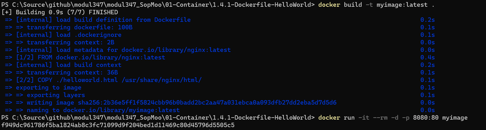
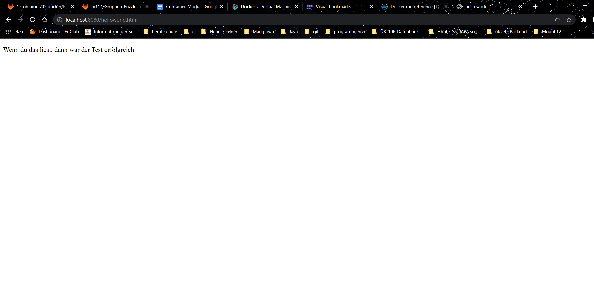

# Hello-World Dockerfile

## Auftrag

Nachdem ich das Dockerfile erstellt habe, welches folgendes beinhaltet:

```
FROM nginx:latest
COPY ./helloworld.html /usr/share/nginx/html/
```

,habe ich das HTML-File erstellt. In der Konsole habe ich dann folgende zwei Befehle ausgeführt:

Zuerst: 

```
docker build -t myimage:latest .
```

dann: 

```
docker run -it --rm -d -p 8080:80 myimage
```

Das Ergebnis war dann folgendes:



Danach habe ich das HTML file aufgerufen, über folgenden URL: http://localhost:8080/helloworld.html




## Erklärung

**Machen Sie den Test, ob ihr container richtig läuft. Welche Web-Adresse müssen Sie eingeben?**

http://localhost:port
also: http://localhost:8080/ oder wenn ich noch das File will: http://localhost:8080/helloworld.html

**Erklären Sie die obigen Schritte und Befehle sowie die einzelnen Parameter.**

1.) docker build -> ist verständlich 
2.) -t -> ein image tagen 
3.) . -> der Punkt am Ende zeigt auf den lokalen-order, so wird das dockerfile benutzt alternative "-f" und dann auf das file

4.) docker run -> verständlich
5.) -it -> The -it instructs Docker to allocate a pseudo-TTY connected to the container’s stdin; creating an interactive bash shell in the container.
6.) --rm -> Container löscht sich beim schliessen
7.) -d -> runnt container im Hintergrund und printed ID aus.

**Wieviele images können aus einem dockerfile erstellt werden?**
Unendlich viele.